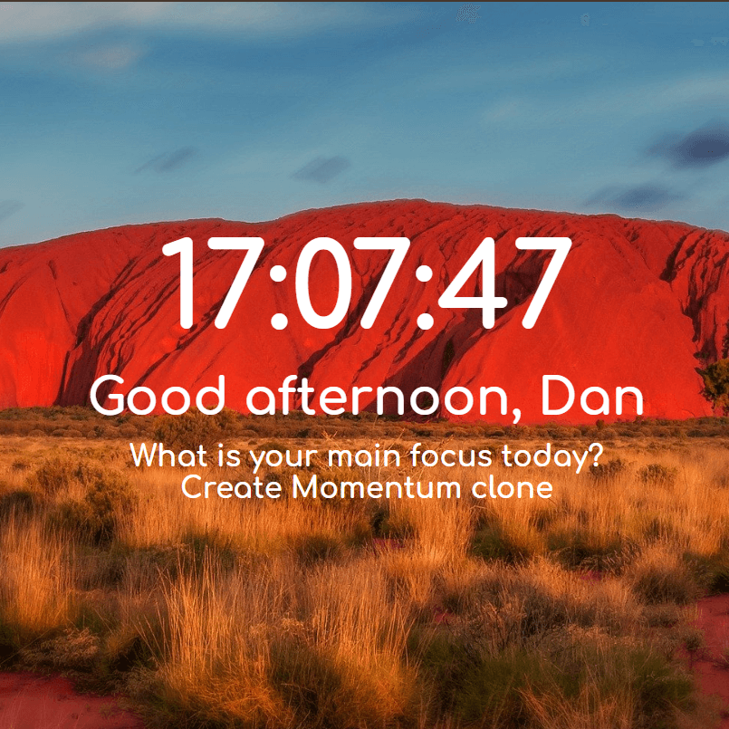

# #oneDay
> *Code* everyday, *learn* everyday!  
> In this repository I challenge myself to create one project a day until I land a job.  
> #oneDay, ***Code*** everyday, ***learn*** everyday! This is a challenge to myself where I will try to create every day one small project (or if bigger over two or more days) until I land a position as a developer.  
> - The important part of this challenge is that I *code* everyday and *learn* everyday. The same time I will document my journey.
> - Every challenge needs to be documented with a **screenshot**, **description**, **what I used** to create the project, **what I learned** in the project and it needs to have a **start** and **finishing** date.  
> - *Optional*: Every 10th day I will create a summary where I will describe how the last 10 days went, if there was something I struggled with, if there is something I see that I get more comfortable with, if there is something significant that I learned and how I feel about the last days.    
> - If you are new to coding and you want to make sure that you code everyday and maybe get a job in the industry if that is something you would like then feel free to create your own oneDay repository  and to share your projects with the community .  
> - If you do the challenge feel free to send me a link on Twitter to you project I would love to see what you created [@CodeWeis](https://twitter.com/CodeWeis) and put the #oneDayCodeEverydayLearnEveryday
> ### But don’t forget the most important thing is HAVE FUN and learn everyday !!

---

### #1 Momentum clone

#### Description:
In this project I recreated a basic Momentum clone.

##### What I used:
- HTML
- CSS
- Vanilla JavaScript

##### What did I learn:
- I get more deep in to work with the Date Object
- I learned how to use local storage

Started & Finished: 19/05/2020

---

### #2 Name

#### Description:

##### What I used:
-
-

##### What did I learn:
-
-

Started & Finished: Date

---

### #3 Name

#### Description:

##### What I used:
-
-

##### What did I learn:
-
-

Started & Finished: Date
