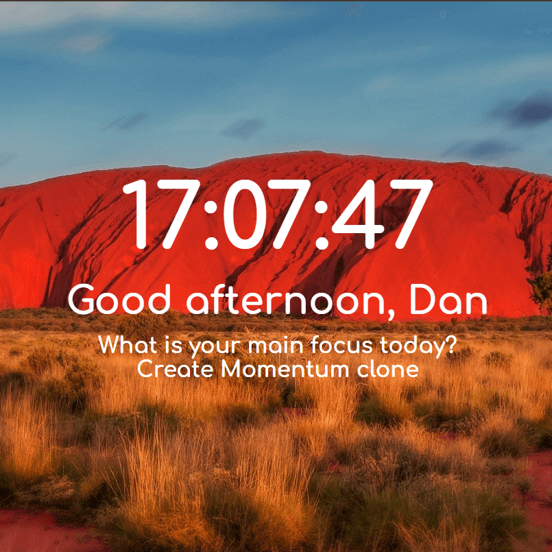
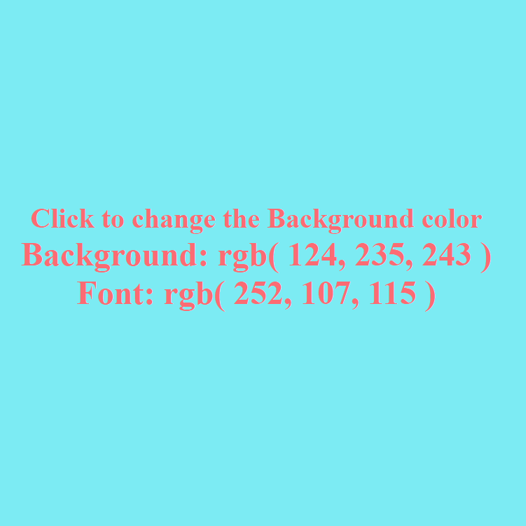
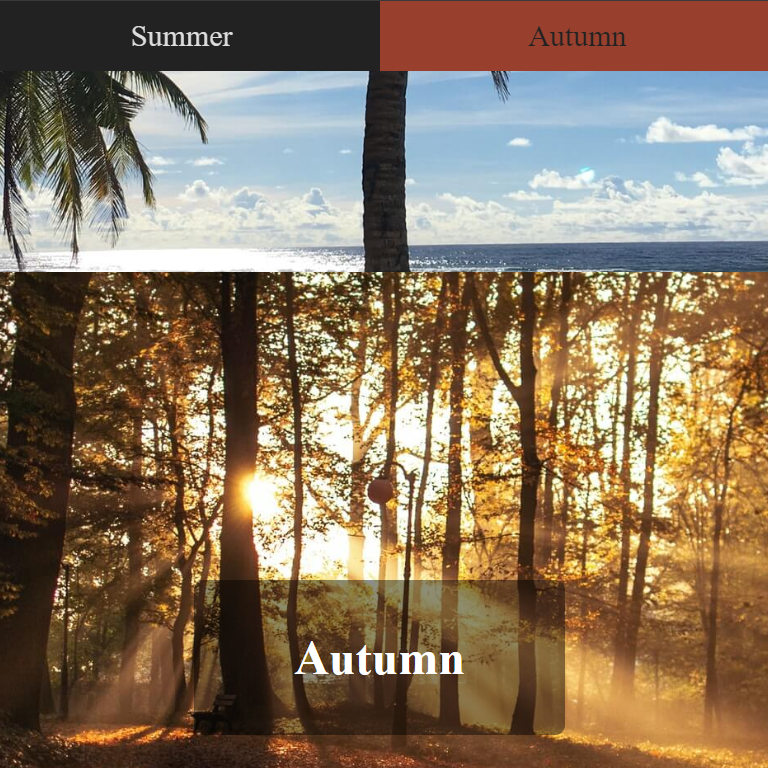
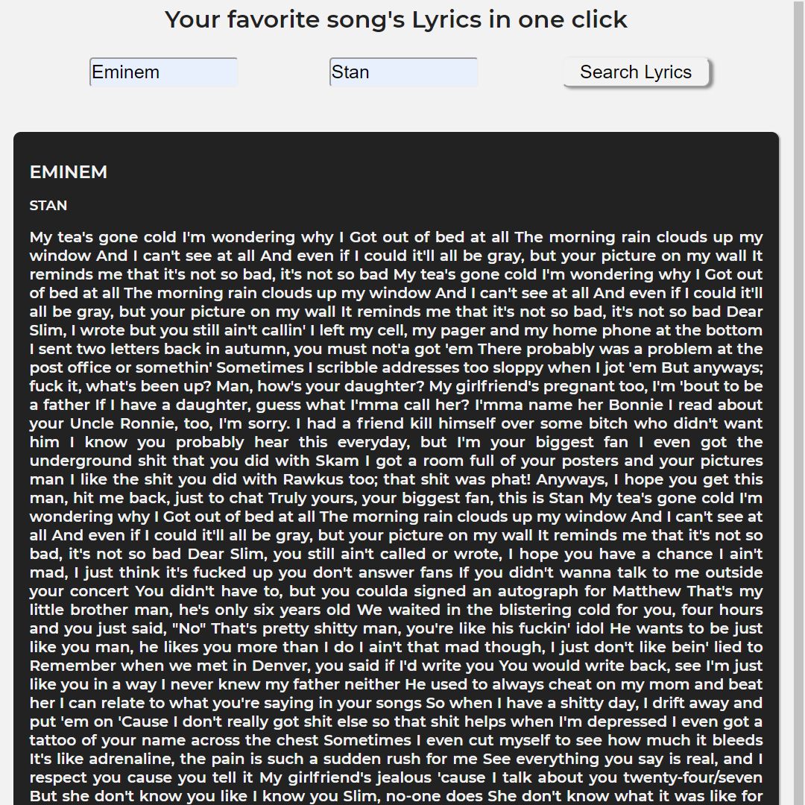
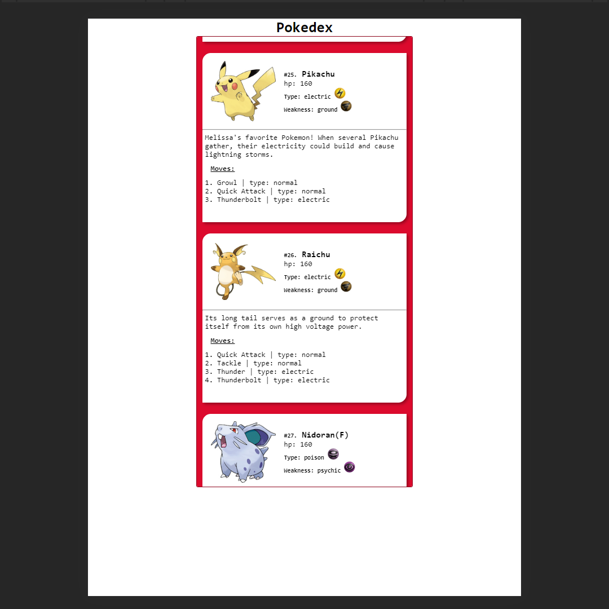
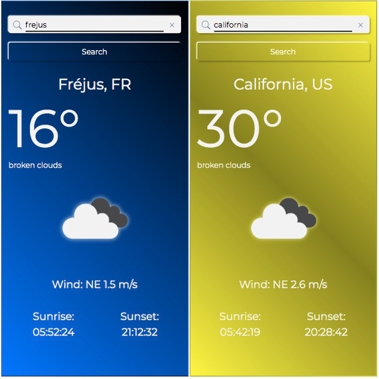
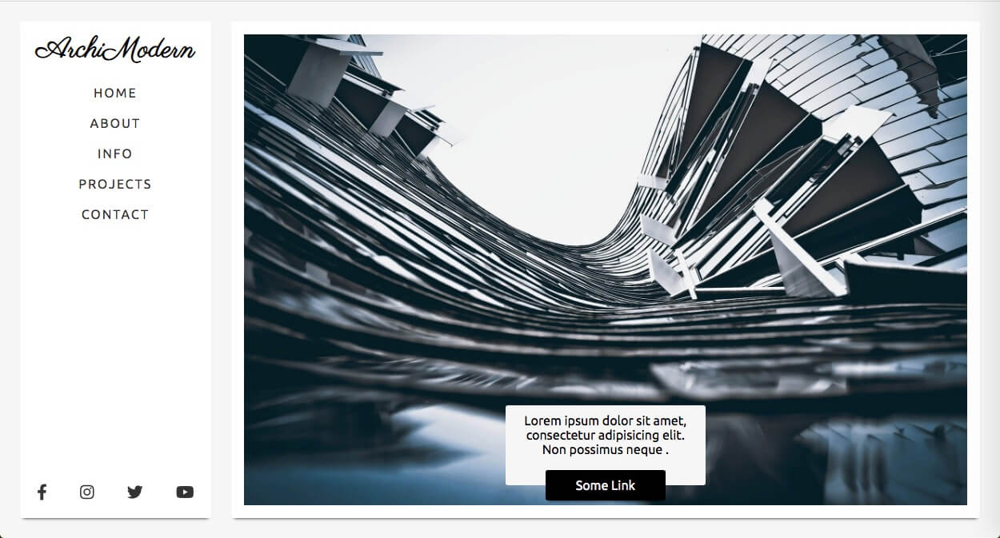
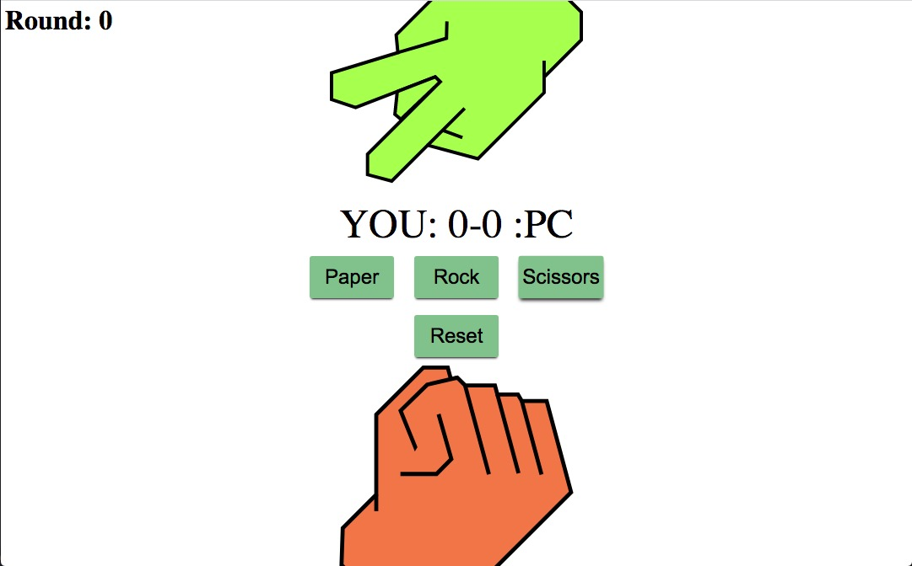

# #oneDay

> _Code_ everyday, _learn_ everyday!
>
> In this repository I challenge myself to create one project a day until I land a job.  
> #oneDay, **_Code_** everyday, **_learn_** everyday! This is a challenge to myself where I will try to create every day one small project (or if bigger over two or more days) until I land a position as a developer.
>
> (For the moment I focus on learning Vue.js and I'm not creating projects but they will come back)
>
> -   The important part of this challenge is that I _code_ everyday and _learn_ everyday. The same time I will document my journey.
> -   Every challenge needs to be documented with a **screenshot**, **description**, **what I used** to create the project, **what I learned** in the project and it needs to have a **start** and **finishing** date.
>
> -   _Optional_: Every 10th day I will create a summary where I will describe how the last 10 days went, if there was something I struggled with, if there is something I see that I get more comfortable with, if there is something significant that I learned and how I feel about the last days.
> -   If you are new to coding and you want to make sure that you code everyday and maybe get a job in the industry if that is something you would like then feel free to create your own oneDay repository and to share your projects with the community .
>
> -   If you do the challenge feel free to send me a link on Twitter to you project I would love to see what you created [@CodeWeis](https://twitter.com/CodeWeis) and put the #oneDayCodeEverydayLearnEveryday or come and join the [Facebook group](www.facebook.com/groups/onedaycode/)
>
> ### But don’t forget the most important thing is HAVE FUN and learn everyday !!

---

### [All the Projects](https://danyweis.com/Project/smallProjects/project.html)

---

# #1 [Momentum clone](https://danyweis.com/Project/smallProjects/001momentum.html)

#### Description:

In this project I recreated a basic Momentum clone.

##### What I used:

-   HTML
-   CSS
-   Vanilla JavaScript

##### What did I learn:

-   I get more deep in to work with the Date Object
-   I learned how to use local storage

Started & Finished: 19/05/2020

---

# #2 [Random background color on click](https://danyweis.com/Project/smallProjects/002randomBGonclick.html)

#### Description:

This is a small project where the color of the background changes randomly on every click

##### What I used:

-   HTML
-   Vanilla JavaScript

##### What did I learn:

-   How to make text on a website unselectable

Started & Finished: 20/05/2020

---

# #3 [Color converter](https://danyweis.com/Project/smallProjects/003rgb2hex.html)

#### Description:

This is a RGB to HEX and HEX to RGB converter

##### What I used:

-   HTML
-   CSS
-   Vanilla JavaScript

##### What did I learn:

-I learned a lot about colors and that I still need a lot to learn about colors
-Hot to take the users input and work with it

Started & Finished: 21/05/2020

---

# #4 [Flip a Coin](https://danyweis.com/Project/smallProjects/004FlipCoin.html)

#### Description:

Just a simple coin flip for that I have time to focus on learning today

##### What I used:

-   Math.random()
-   Math.floor()

##### What did I learn:

-   toggle attribute

Started & Finished: 22/05/2020

---

# #5 [What age?](https://danyweis.com/Project/smallProjects/005age.html)

#### Description:

Input will be a birth date and it will tell you how long until your next Birthday or if it is your birthday

##### What I used:

-   JavaScript : date object
-   HTML : type date

##### What did I learn:

-   how to use type="date" value in JavaScript
-   how to find out if the browser is Safari and then to show type="number"

Started & Finished: 23/05/2020

---

# #6 [CSS Hero slider](https://danyweis.com/Project/smallProjects/006heroSlider.html)

#### Description:

This is a hero slider build with no JavaScript only CSS

##### What I used:

-   CSS keyframes

##### What did I learn:

-   how to use CSS keyframes

Started & Finished: 24/05/2020

---

# Update project #7

#### Description:

Today no finished project to show I do currently work on a bigger project since  
the 25/05/2020, It is the guess the color game everything in HTML CSS AND Vanilla JavaScript

---

# Update project #7

#### Description:

The game is now playable but still some bugs to fix and the time system is not yet in place

---

# #7 [Guess the color](https://danyweis.com/Project/smallProjects/007guessColor.html)

#### Description:

This is the game guess the color

##### What I used:

-   HTML
-   CSS grid
-   Vanilla JavaScript

##### What did I learn:

-   how to handle user inputs on buttons
-   display elements depending on the inputs
-   the game works without page reload

Started & Finished: 25/05/2020 -> 27/05/2020

// There will be a time count implemented later on with storing best times in local storage

---

# #8 [Stop Watch](https://danyweis.com/Project/smallProjects/008stopWatch.html)

#### Description:

This is a simple stop watch wit start stop and reset function

#### What I used:

-   Vanilla JavaScript
-   setInterval
-   clearInterval

#### What did I learn:

-   How to use setInterval
-   How to use clearInterval

Started & Finished: 28/05/2020

---

# #9 [Pomodoro](https://danyweis.com/Project/smallProjects/009pomodoro.html)

#### Description:

This is a small Pomodoro I created to be a google chrome extension

#### What I used:

-   Vanilla JavaScript
-   setInterval
-   clearInterval
-   CSS to creat an animation

#### What did I learn:

-   How to use setInterval
-   How to use clearInterval

Started & Finished: 29/05/2020

---

# #10 [Navbar](https://danyweis.com/Project/smallProjects/010navbar.html)

#### Description:

Navbar with hover effect and active highlight

#### What I used:

-   JavaScript mouseover
-   CSS ::after

#### What did I learn:

-   To do animation on hover with the css ::after
-   how to use e.target

Started & Finished: 30/05/2020

---

# #11 [Covid-19 API](https://danyweis.com/Project/smallProjects/011CovidAPI.html)

#### Description:

#### What I used:

-   fetch

#### What did I learn:

-   How to call an API

Started & Finished: 31/05/2020

---

# #12 [Your favorite Lyrics](https://danyweis.com/Project/smallProjects/012song.html)

#### Description:

#### What I used:

-   Vanilla JavaScript with fetch

#### What did I learn:

-   Implement error handling

Started & Finished: 01/06/2020

---

# #13 [Crypto Tracker](https://danyweis.com/Project/smallProjects/013crypto.html)

#### Description:

This is a project which I will grow by time the more I learn

#### What I used:

-   Two crypto API's which I mix to get the info I wanted

#### What did I learn:

-   How to mix two APIs

Started & Finished: 02/06/2020

---

# #14 [Pokedex](https://danyweis.com/Project/smallProjects/014pokedex.html)

#### Description:

This is an easy Pokedex in which I started using Vue.js

#### What I used:

-   Vue.js

-   Two Pokemon API's

#### What did I learn:

-   Started to work with Vue.js

Started & Finished: 05/06/2020

---

# #15 [Weather App](https://danyweis.com/Project/smallProjects/015weather.html)

#### Description:

This is an weather app showing information's about the weather

#### What I used:

-   Weather API

-   Vue.js

#### What did I learn:

-   I try to use Vue.js more and more

Started & Finished: 09/06/2020

---

# Update:

Today we are the 14th June, I started this repo almost one month ago and wanted to do an update, I started to learn Vue JS so I don't push a project everyday because it takes a bit time to find the answers to all the questions which come over the time of a project. But I get mor confident with the syntax and all the small details. To soon come back to one project a day for the moment I did update the [Crypto project](https://github.com/danyweis/cryptoProject) which is not in the list now but it has his own repo because it will become a bigger project .

Anyway I started my next project in Vue JS and it will be soon pushed.

---

# #16 [Landing page ArchiModern](https://danyweis.com/Project/smallProjects/016landingA/index.html)

#### Description:

This is a Modern Landing page build with VueJs

#### What I used:

-   Vue JS

#### What did I learn:

-   How to switch from one component to an other without destroying the component

-   How to use Mixins

-   How to call two methods on one link

Started & Finished: 14/06/2020

---

# #17 [Paper Rock Scissors](https://danyweis.com/Project/smallProjects/017PRS.html)

#### Description:

I created a small Paper Rock Scissors game

#### What I used:

-   Vanilla JavaScript

Started & Finished: 19/06/2020

---

# #18 [ISS Position ](link)

[Repository](https://github.com/danyweis/issPosition)

#### Description:

In this project you can see the position of the ISS Space station in real time.

#### What I used:

-   API for the Longitude and Latitude

#### What did I learn:

-   How to calculate the Longitude and Latitude and put them on the correct position on the map

Started & Finished: 21/06/2020

---

# #Number [Name](link)

#### Description:

#### What I used:

-

#### What did I learn:

-

Started & Finished: 28/05/2020
